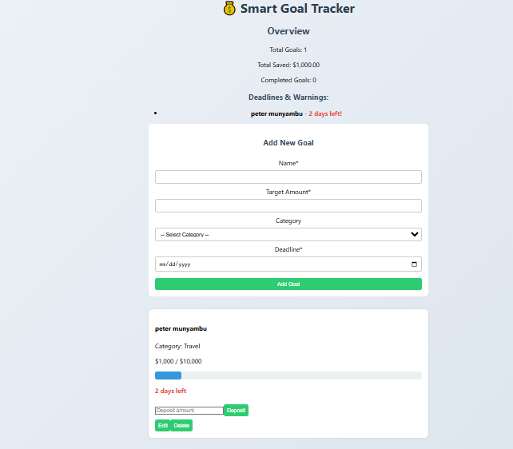

# 🎯 Smart Goal Planner

A user-friendly web application that helps individuals set, track, and manage their financial goals. Users can define SMART goals, make deposits, view progress, and stay motivated through clear visual updates.

## 🚀 Features

- ✅ Add and manage multiple goals
- 📈 Real-time savings tracking
- 💡 SMART goal principles integration
- 🏦 Deposit towards goals
- 📅 calender
- 📊 Overview dashboard: total goals, savings, and completed goals
- 📅 Deadline setting with warnings plus calender
- 🎨 Beautiful and responsive UI

## 🧠 MVP Structure

| Component   | Description                                          |
| ----------- | ---------------------------------------------------- |
| Header      | Displays the app's name in a styled banner           |
| GoalForm    | Form for adding new SMART goals                      |
| GoalList    | Lists all user-created goals                         |
| GoalItem    | Displays each goal with options to deposit or delete |
| DepositForm | Allows user to deposit money toward a goal           |
| Overview    | Summary: total goals, saved amount, completed goals  |
| api.js      | Handles all backend CRUD operations (REST API)       |

## 🛠️ Built With

- React.js – frontend framework
- JavaScript – logic and interaction
- CSS3 – custom component styling
- JSON Server (or local API) – mock backend for development

## 📂 Project Structure

smart-goal-planner/

├── src/
│ ├── components/
│ │ ├── Header.js
│ │ ├── GoalForm.js
│ │ ├── GoalList.js
│ │ ├── GoalItem.js
│ │ └── DepositForm.js
│ ├── App.js
│ ├── api.js
│ └── index.js
│
├── db.json # Optional if using JSON server
├── App.css
└── README.md

## 🚀 How the MVP Works – Smart Goal Planner

🎯 Goal Creation

Users can create goals with:
Name, Target Amount, Category (dropdown), and Deadline.

Goals are saved and listed immediately.
📊 Overview Panel
Displays real-time summary:
Total number of goals
Total amount saved
Number of completed goals

💰 Deposit Function

Users can deposit money into individual goals.

Automatically updates the saved amount.

When the saved amount reaches the target, the goal is marked as completed.

## 📦 Getting Started

### Prerequisites

- Node.js and npm installed
- React project created (or use this one)
- JSON server or API backend

### Installation

bash
git clone https://github.com/your-username/smart-goal-planner.git
cd smart-goal-planner
npm install

### Run the app

`bash
npm start

If using JSON Server:

`bash
npx json-server --watch db.json --port 3000

## 🧪 Future Improvements

- 🎯 Add categories with icons
- ⏰ Goal reminders and notifications
- 📱 Mobile app version
- 🔐 User authentication for personal tracking

## 🙌 Author

Peter Munyambu

## 📄 License

This project is licensed under the MIT License.
